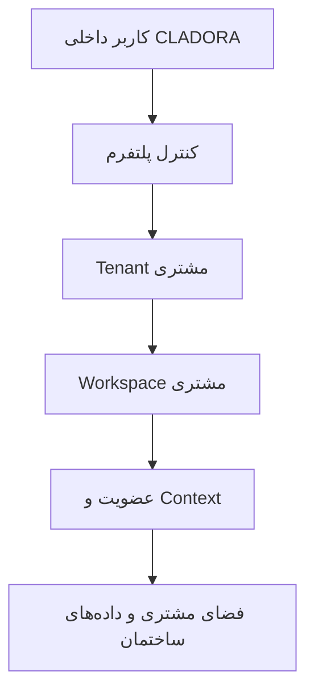
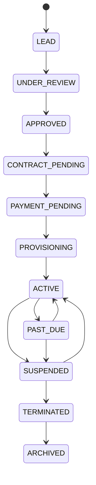
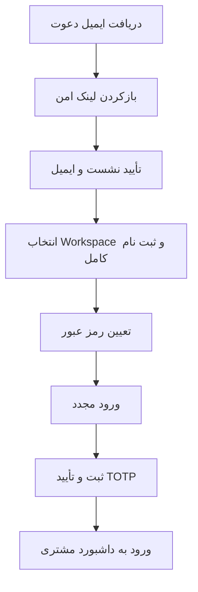

# راهنمای نقش‌ها، منوها و مسیرهای کاربری CLADORA

- **نسخه:** 1.1 (پیش‌نویس بازبینی مشترک)
- **تاریخ مبنا:** 2026-09-24
- **دامنه:** کنترل پلتفرم، فضای مشتری، نقش‌ها، منوها، دعوت مدیر اصلی و ورود امن
- **زبان مرجع این نسخه:** فارسی

## 1. هدف و روش استفاده

این سند برای پاسخ دقیق به چهار پرسش تهیه شده است:

1. هر اصطلاح در CLADORA چه معنایی دارد؟
2. هر نقش به کدام بخش تعلق دارد و چه حدودی دارد؟
3. هر منو تحت چه شرایطی نمایش داده می‌شود؟
4. سوپرادمین و مدیر ساختمان برای ایجاد و فعال‌سازی حساب چه مراحلی را طی می‌کنند؟

این سند «راهنمای عملیاتی قابل بازبینی» است. در تعارض احتمالی، ترتیب مرجع چنین است:

1. کنترل دسترسی پایگاه‌داده و RLS؛
2. API و کنترل‌های سمت سرور؛
3. ماتریس نقش و مسیر در کد؛
4. نمایش یا عدم نمایش منو در رابط کاربری؛
5. این سند.

نمایش یک منو به‌تنهایی مجوز دسترسی محسوب نمی‌شود. هر عملیات باید دوباره در API و پایگاه‌داده مجاز شناخته شود.

## 2. مدل کلان سامانه

### 2.1 جداسازی دو بخش اصلی

| بخش | کاربران اصلی | کاربرد | مسیر اصلی |
|---|---|---|---|
| کنترل پلتفرم (Control Plane) | کارکنان داخلی CLADORA | مشتری، قرارداد، طرح، Provisioning، ممیزی و پشتیبانی | `/{lang}/platform/*` |
| فضای مشتری (Customer Data Plane) | مدیر ساختمان، مدیر شرکت، رئیس، بازرس، مالک و ساکن | عملیات و اطلاعات همان Tenant/Workspace مجاز | `/{lang}/app/*` |

سوپرادمین پلتفرم به‌صورت عادی مجاز به خواندن داده‌های خصوصی مالی یا ساختمانی مشتری نیست. ورود پشتیبانی به داده حساس فقط با دسترسی موقت، ثبت‌شده و دوکنترلی انجام می‌شود.

## 3. واژه‌نامه

| اصطلاح | تعریف عملیاتی |
|---|---|
| Tenant | مرز حقوقی و داده‌ای یک مشتری؛ عضویت‌ها، نقش‌ها و اطلاعات مشتری به آن وابسته‌اند. |
| Workspace | محیط عملیاتی یک مشتری در CLADORA که به یک Tenant متصل است. |
| Workspace Type | نوع محیط: `ASSOCIATION`، `PROPERTY_MANAGER`، `OWNER_PORTFOLIO` یا `HYBRID`. |
| Environment | نوع محیط اجرایی: `PILOT` برای آزمایش کنترل‌شده یا `PRODUCTION` برای بهره‌برداری واقعی. |
| Lifecycle | وضعیت تجاری و عملیاتی Workspace از سرنخ تا بایگانی. |
| Platform Role | نقش کاربر داخلی CLADORA در Control Plane. |
| Customer Role | نقش کاربر مشتری در Customer Data Plane. |
| Assignment | تخصیص زمانی یک کارشناس داخلی CLADORA به Workspace و Scope مشخص. |
| Membership | اتصال یک کاربر احراز هویت‌شده به Tenant و نقش مشتری. |
| Context | زمینه فعال کاربر شامل Tenant، نقش و Scope. یک کاربر ممکن است چند Context داشته باشد. |
| Scope | محدوده اثر دسترسی. در Customer Data Plane سلسله‌مراتب آن `workspace > property > building > unit` است. |
| Permission | اجازه یک عمل یا خواندن مشخص؛ برای مثال `finance.ledger.read`. |
| Module | ماژول فنی/عملیاتی فعال؛ برای مثال `accounting` یا `maintenance`. |
| Entitlement | حق قراردادی استفاده از قابلیت یا ماژول؛ برای مثال `module.documents`. |
| AAL2 | نشست ورود با عامل دوم تأییدشده؛ در CLADORA از TOTP برنامه Authenticator استفاده می‌شود. |
| Primary Administrator | اولین مدیر مشتری که توسط Control Plane دعوت می‌شود و عضویت اصلی Workspace را می‌گیرد. |
| Provisioning | مرحله آماده‌سازی کنترل‌شده Workspace پیش از فعال‌سازی. |

### 3.1 فرمول دسترسی

دسترسی پلتفرم حاصل ترکیب نقش، تخصیص، Scope، زمان اعتبار و وضعیت Workspace است.

در فضای مشتری، تصمیم نهایی باید این مدل را رعایت کند:

`Common Gates AND NOT(Applicable Scoped Deny) AND Any(Applicable Allow)`

بنابراین نقش به‌تنهایی کافی نیست؛ ماژول، Entitlement، Permission، Scope، Context و وضعیت نشست نیز بررسی می‌شوند.

## 4. چرخه عمر Workspace

قواعد مهم:

- دعوت مدیر اصلی فقط در وضعیت `PROVISIONING` مجاز است.
- دعوت 1 تا 72 ساعت اعتبار دارد؛ رابط فعلی گزینه‌های 24، 48 و 72 ساعت را ارائه می‌کند.
- `ARCHIVED` نهایی است.
- فعال‌سازی Workspace تولیدی بدون مدیر اصلی پذیرفته‌شده، عضویت فعال، MFA تأییدشده و تکمیل Onboarding مسدود است.
- Workspaceهای `ACTIVE` موجود نباید برای آزمایش دعوت به عقب برگردانده شوند.

## 5. نقش‌های داخلی پلتفرم

| نقش | مسئولیت اصلی | حدود مهم |
|---|---|---|
| `PLATFORM_SUPER_ADMIN` | مدیریت کاربران داخلی، تنظیمات کلان، چرخه Workspace و عملیات اضطراری | دسترسی عادی به داده خصوصی مشتری ندارد؛ تأیید دسترسی پشتیبانی خودش ممنوع است. |
| `PLATFORM_OPERATIONS` | Workspaceهای تخصیص‌یافته، Provisioning و دعوت مدیر اصلی | فقط Workspace تخصیص‌یافته؛ قرارداد و بایگانی خارج از اختیار عادی است. |
| `PLATFORM_FINANCE` | قرارداد، طرح، Entitlement و اطلاعات تجاری | به داده عملیاتی ساختمان دسترسی ندارد. |
| `PLATFORM_SUPPORT` | تشخیص فنی و درخواست دسترسی پشتیبانی | دسترسی حساس فقط موقت و دوکنترلی؛ تغییر نقش و قرارداد ممنوع است. |
| `PLATFORM_AUDITOR` | ممیزی Control Plane | فقط خواندنی؛ تغییر داده و RPCهای جهش وضعیت ممنوع است. |

تمام نقش‌های پلتفرم به TOTP و نشست `AAL2` نیاز دارند.

## 6. منوهای کنترل پلتفرم

نمادها: ✓ نمایش برای نقش، — عدم نمایش.

| منوی فارسی | Super Admin | Operations | Finance | Support | Auditor | کاربرد |
|---|:---:|:---:|:---:|:---:|:---:|---|
| نمای کلی پلتفرم | ✓ | ✓ | ✓ | ✓ | ✓ | سلامت و شاخص‌های کلی مجاز |
| محیط‌های کاری و مشتریان | ✓ | ✓ | ✓ | — | ✓ | فهرست Workspaceها و دعوت مدیر اصلی در `PROVISIONING` |
| قراردادها و صدور صورت‌حساب | ✓ | — | ✓ | — | ✓ | قراردادها، طرح‌ها و Entitlementهای تجاری |
| طرح‌ها و دسترسی‌های مجاز | ✓ | ✓ | ✓ | — | ✓ | نسخه طرح و کاتالوگ قابلیت‌ها |
| کاربران داخلی پلتفرم | ✓ | — | — | — | ✓ | کارکنان داخلی CLADORA؛ محل دعوت مدیر ساختمان نیست |
| تخصیص مشتریان به کارشناسان | ✓ | ✓ | — | — | ✓ | Assignmentهای Workspace |
| سوابق آماده‌سازی و فعال‌سازی | ✓ | ✓ | — | — | ✓ | Provisioning run و task |
| نگهداری و دستور حقوقی | ✓ | ✓ | — | — | ✓ | Retention و Legal Hold |
| گزارش‌های ممیزی و امنیت | ✓ | — | — | — | ✓ | رویدادهای امنیتی و ممیزی |
| دسترسی پشتیبانی فنی | ✓ | ✓ | — | ✓ | ✓ | درخواست/تأیید/لغو دسترسی پشتیبانی دوکنترلی |

این جدول نحوه نمایش منو را توصیف می‌کند. اجرای هر عمل علاوه بر نقش، به AAL2، Assignment، Scope و کنترل API/RLS وابسته است.

## 7. نقش‌های مشتری

| نقش | عنوان فارسی | حالت | محدوده معمول | نکته اصلی |
|---|---|---|---|---|
| `association_admin` | مدیر ساختمان / مدیر انجمن | مدیریتی | Tenant، Property یا Building | عملیات، مالی و ممیزی مجاز؛ نقش ترجیحی Workspace نوع `ASSOCIATION` |
| `property_manager` | مدیر شرکت مدیریت املاک | مدیریتی | Tenant، Property یا Building | عملیات چندملکی، مالی و ممیزی؛ نقش ترجیحی Workspace نوع `PROPERTY_MANAGER` |
| `president` | رئیس انجمن | فقط‌خواندنی نظارتی | زمینه انجمن | حاکمیت، خلاصه مالی و ممیزی؛ عملیات اجرایی ممنوع |
| `censor` | بازرس مالی | فقط‌خواندنی | کنترل مالی | گزارش مالی و ممیزی؛ جهش مالی یا تأیید عملیات ممنوع |
| `owner` | مالک | محدود به اطلاعات خود | واحدها و حقوق مالی خود | داده سایر واحدها و رجیستر عمومی ساکنان ممنوع |
| `tenant_resident` | مستأجر / ساکن | محدود به اطلاعات خود | سکونت، هزینه و مصرف خود | مالکیت، ممیزی عمومی و داده سایر واحدها ممنوع |

برای `association_admin`، `property_manager`، `president` و `censor` عامل دوم TOTP و AAL2 اجباری است. برای `owner` و `tenant_resident` ثبت MFA اختیاری است؛ اگر فعال شود، نشست‌های بعدی باید AAL2 را تکمیل کنند.

## 8. منوهای فضای مشتری

نمایش واقعی هر ردیف از تقاطع چهار شرط به دست می‌آید:

`Role allowlist ∩ Permission ∩ Module/Entitlement ∩ Context فعال`

| منوی فارسی | مسیر | نقش‌های قابل نمایش | شرط فنی افزوده |
|---|---|---|---|
| داشبورد | `/app/dashboard` | همه 6 نقش | Context فعال برای داده زنده |
| دفتر کل حسابداری | `/app/accounting` | مدیر ساختمان، مدیر شرکت، رئیس، بازرس | `finance.ledger.read` + ماژول `accounting` |
| تسهیم و حقوق مالی | `/app/accounting/allocations` | مدیر ساختمان، مدیر شرکت، رئیس، بازرس | `finance.allocations.read` |
| گزارش‌های مالی | `/app/accounting/reports` | مدیر ساختمان، مدیر شرکت، رئیس، بازرس | `finance.reports.read` + `accounting` |
| بستن ماه | `/app/accounting/month-close` | مدیر ساختمان، مدیر شرکت، رئیس، بازرس | `finance.periods.read` + `accounting`؛ رئیس و بازرس فقط‌خواندنی‌اند |
| کنتورها و خدمات | `/app/meters` | مدیر ساختمان، مدیر شرکت، ساکن | `utilities.metering.read` + `module.utilities` |
| دارایی‌ها | `/app/assets` | مدیر ساختمان، مدیر شرکت | `maintenance.assets.read` + `module.maintenance` |
| نگهداری | `/app/maintenance` | مدیر ساختمان، مدیر شرکت | `maintenance.assets.read` + `module.maintenance` |
| فروشندگان و تدارکات | `/app/vendors` | مدیر ساختمان، مدیر شرکت، رئیس | `maintenance.procurement.read` + `module.maintenance` |
| حاکمیت | `/app/governance` | مدیر ساختمان، رئیس، مالک | `governance.meetings.read` + `module.governance` |
| جلسات | `/app/meetings` | مدیر ساختمان، رئیس، مالک | `governance.meetings.read` + `module.governance` |
| ارتباطات | `/app/communications` | مدیر ساختمان، مدیر شرکت، رئیس، مالک، ساکن | `communications.feed.read` + `module.communications` |
| اعلان‌ها | `/app/notifications` | مدیر ساختمان، مدیر شرکت، رئیس، مالک، ساکن | `communications.feed.read` + `module.communications` |
| اسناد | `/app/documents` | همه 6 نقش | `documents.vault.read` + `module.documents`؛ داده با Scope محدود می‌شود |
| سکونت و ساکنان | `/app/occupancy` | مدیر ساختمان، مدیر شرکت | `occupancy.registry.read` + `module.occupancy` |
| مالکیت و اجاره‌ها | `/app/ownership` | مدیر ساختمان، مدیر شرکت، مالک | `occupancy.registry.read` + `module.occupancy`؛ مالک فقط داده خود |
| دسترسی و امنیت | `/app/security-access` | مدیر ساختمان، مدیر شرکت | `security.access.read` + `module.security` |
| صورتحساب‌ها و مطالبات | `/app/billing` | مدیر ساختمان، مدیر شرکت، رئیس، بازرس | `billing.receivables.read` + `billing` |
| پرداخت‌ها | `/app/payments` | همه 6 نقش | `payments.reconciliation.read` + `payments`؛ Scope داده متفاوت است |
| تطبیق بانکی | `/app/reconciliation` | مدیر ساختمان، مدیر شرکت، رئیس، بازرس | `payments.reconciliation.read` + `payments` |
| گزارش بازرسی | `/app/audit` | مدیر ساختمان، مدیر شرکت، رئیس، بازرس | `audit.events.read` |

مسیرهای `portfolio`، `settings` و `migration/shadow-ledger` در فضای مشتری فعلاً صریحاً unavailable هستند و نباید به‌عنوان قابلیت عملیاتی معرفی شوند.

## 9. نحوه دعوت مدیر اصلی توسط سوپرادمین

### 9.1 پیش‌شرط‌ها

- Tenant مشتری به‌صورت مستقل ایجاد شده باشد.
- Workspace مستقل به Tenant متصل باشد.
- نوع محیط برای آزمایش واقعی `PILOT` باشد.
- Workspace از مسیر تجاری مجاز به `PROVISIONING` رسیده باشد.
- سوپرادمین نشست TOTP/AAL2 معتبر داشته باشد.
- نقش دعوت یکی از این دو مورد باشد:
  - `association_admin`
  - `property_manager`
- ایمیل گیرنده خارج از مخزن عمومی نگهداری و فقط هنگام ارسال وارد شود.

### 9.2 مسیر سوپرادمین در رابط

1. ورود به `https://cladora.ro/fa/login`.
2. تکمیل TOTP در صورت درخواست.
3. ورود به «محیط‌های کاری و مشتریان» در مسیر `/fa/platform/workspaces`.
4. یافتن Workspace با وضعیت `PROVISIONING`.
5. انتخاب «دعوت مدیر ساختمان».
6. ورود ایمیل، نقش، دلیل ممیزی و اعتبار 24/48/72 ساعت.
7. بررسی نهایی گیرنده و انتخاب «ارسال دعوت‌نامه».

منوی «کاربران داخلی پلتفرم» برای کارکنان CLADORA است و برای دعوت مدیر ساختمان استفاده نمی‌شود.

### 9.3 کنترل‌های امنیتی هنگام ارسال

- فقط `PLATFORM_SUPER_ADMIN` یا `PLATFORM_OPERATIONS` تخصیص‌یافته مجاز است.
- API مجدداً AAL2، نقش و Assignment را بررسی می‌کند.
- Role ID در سمت سرور با فهرست دو نقش مدیر اصلی تطبیق داده می‌شود.
- Scope دعوت فعلی فقط `tenant` است.
- در صورت شکست ارسال Auth Email، رکورد دعوت به‌صورت خودکار revoke می‌شود.
- رمز عبور، کد TOTP، توکن خام و لینک کامل دعوت نباید در لاگ، ممیزی یا مستند ثبت شود.

## 10. مسیر کاربری مدیر ساختمان پس از دریافت ایمیل

جزئیات:

1. کاربر لینک دعوت را از ایمیل باز می‌کند.
2. Callback فقط پارامترهای امن و Allowlisted را می‌پذیرد و نشست Supabase Auth را ایجاد می‌کند.
3. سامانه دعوت‌های معتبر همان ایمیل تأییدشده را نمایش می‌دهد.
4. کاربر نام کامل و Workspace موردنظر را تأیید می‌کند.
5. سرور Membership و Context را از داده ذخیره‌شده دعوت می‌سازد؛ مرورگر نمی‌تواند Tenant، Role یا Scope را تعیین کند.
6. کاربر رمزی حداقل 8 نویسه‌ای شامل حداقل یک حرف لاتین و یک عدد تعیین می‌کند.
7. پس از تعیین رمز، همه نشست‌ها خارج می‌شوند و کاربر دوباره وارد می‌شود.
8. چون نقش مدیر ساختمان حساس است، ثبت و تأیید TOTP اجباری است.
9. پس از AAL2، کاربر وارد `/fa/app/dashboard` می‌شود و فقط Contextها و منوهای مجاز خود را می‌بیند.

## 11. وضعیت فعلی Production در تاریخ مبنا

در Production سه Workspace آزمایشی وجود دارد و هر سه `PILOT / ACTIVE` هستند:

| Workspace | Tenant | وضعیت | مدیر اصلی |
|---|---|---|---|
| `P1TEST Admin` | `P1TEST-A Association Tenant` | `ACTIVE` | ثبت نشده |
| `P1TEST Control` | `P1TEST-B Control Tenant` | `ACTIVE` | ثبت نشده |
| `CLADORA controlled synthetic fixture` | `CLADORA Synthetic Pilot Association` | `ACTIVE` | ثبت شده |

نتیجه: اکنون هیچ Workspace با وضعیت `PROVISIONING` وجود ندارد؛ بنابراین دکمه دعوت مدیر ساختمان در رابط نمایش داده نمی‌شود. برای تست واقعی باید یک Tenant و Workspace آزمایشی مستقل ایجاد شود. ایمیل واقعی گیرنده نباید در این مخزن عمومی ثبت شود.

## 12. مشکلات و فاصله‌های قابل پیگیری

اصلاح فنی نسخه 1.1 در شاخه `fix/tokenless-invitation-customer-api-gateway` آماده شده است. دو RPC مرحله ادامه و قبول دعوت از مرز عمومی و محدود `customer_api` عبور می‌کنند و نقش‌های `association_admin` و `property_manager` هنگام claim به‌عنوان مدیر اصلی Workspace شناخته می‌شوند. این اصلاح تا زمان اجرای CI، اعمال migration و استقرار Production در محیط عملیاتی فعال نیست.

| شناسه | اهمیت | مشاهده | نتیجه مورد انتظار |
|---|---|---|---|
| `DOC-REV-001` | مسدودکننده تست | هیچ Workspace در `PROVISIONING` نیست. | ایجاد Tenant/Workspace مستقل `PILOT` بدون تغییر Workspaceهای `ACTIVE`. |
| `DOC-REV-002` | بالا | رابط Workspace فقط فهرست و دعوت را نشان می‌دهد؛ فرم ایجاد Tenant/Workspace در این صفحه وجود ندارد. | طراحی جریان امن ایجاد مشتری و Workspace با دلیل ممیزی. |
| `DOC-REV-003` | بالا | API تغییر Lifecycle وجود دارد، اما عمل تغییر وضعیت در جدول Workspace نمایش داده نشده است. | UI کنترل‌شده برای Transition با نسخه مورد انتظار و دلیل. |
| `DOC-REV-004` | رفع‌شده در کد و در انتظار استقرار | صفحه ادامه دعوت و API claim مستقیماً RPCهای schema خصوصی `platform` را فراخوانی می‌کردند. | gateway محدود و `SECURITY INVOKER` در `customer_api` افزوده شد؛ اعمال migration و Smoke Test Production باقی است. |
| `DOC-REV-005` | متوسط | برخی ADRها وضعیت تاریخی «Proposed/Deferred» دارند، اما بخشی از قابلیت‌ها اکنون در Production پیاده شده‌اند. | به‌روزرسانی Status و Rollout note بدون بازنویسی تاریخچه تصمیم. |
| `DOC-REV-006` | متوسط | نقش‌های مجاز مسیر و منوی ظاهری با Permission/Module/Entitlement ترکیب می‌شوند و ممکن است برای کاربر قابل توضیح نباشند. | افزودن صفحه «چرا این منو را نمی‌بینم؟» با علت غیرحساس و قابل پشتیبانی. |
| `DOC-REV-007` | رفع‌شده در کد و در انتظار استقرار | claim فقط نقش‌های قدیمی `WORKSPACE_OWNER` و `WORKSPACE_ADMIN` را مدیر اصلی تشخیص می‌داد و با نقش‌های دعوت فعلی ناسازگار بود. | `association_admin` و `property_manager` نیز به فهرست مدیر اصلی افزوده شدند و تست اتصال مدیر اصلی، Membership، Context و Audit اضافه شد. |

## 13. چک‌لیست تست مشترک

### 13.1 کنترل پلتفرم

- [ ] ورود سوپرادمین فقط پس از TOTP/AAL2
- [ ] نمایش 10 منوی مجاز سوپرادمین
- [ ] عدم استفاده از «کاربران داخلی پلتفرم» برای مدیر ساختمان
- [ ] ایجاد Tenant/Workspace آزمایشی مستقل
- [ ] طی Transitionهای مجاز تا `PROVISIONING`
- [ ] نمایش دکمه «دعوت مدیر ساختمان» فقط در `PROVISIONING`
- [ ] ثبت ایمیل، نقش، دلیل و زمان اعتبار
- [ ] ثبت رویداد ممیزی بدون ایمیل یا توکن خام

### 13.2 گیرنده دعوت

- [ ] دریافت ایمیل در Inbox و بررسی Spam
- [ ] بازشدن لینک فقط روی دامنه مجاز CLADORA
- [ ] نمایش Workspace و نقش صحیح
- [ ] عدم امکان انتخاب Tenant، Role یا Scope از درخواست دستکاری‌شده
- [ ] تعیین رمز مطابق Policy
- [ ] خروج اجباری و ورود مجدد
- [ ] ثبت و تأیید TOTP
- [ ] ورود به داشبورد با Context صحیح

### 13.3 کنترل منو و داده

- [ ] منوها مطابق نقش، Permission، Module و Entitlement
- [ ] جلوگیری از بازکردن مستقیم مسیر غیرمجاز
- [ ] عدم مشاهده داده Tenant دیگر
- [ ] اعمال حالت فقط‌خواندنی برای رئیس و بازرس
- [ ] نمایش فقط داده خود برای مالک و ساکن
- [ ] خروج امن و پاک‌شدن Context نشست

## 14. منابع فنی داخلی

- `src/components/platform/PlatformShell.tsx`
- `src/components/platform/OperationalWorkspacesTable.tsx`
- `src/lib/platform/auth.ts`
- `src/components/customer/CustomerAppShell.tsx`
- `src/lib/customer/access-matrix.ts`
- `src/lib/customer/route-classifier.ts`
- `src/app/api/platform/v1/workspaces/[id]/invitations/route.ts`
- `src/components/auth/WorkspaceInvitationContinuation.tsx`
- `docs/architecture/ADR-CLD-023-platform-control-plane.md`
- `docs/architecture/ADR-CLD-024-secure-workspace-invitations.md`
- `docs/architecture/ADR-CLD-048-tokenless-workspace-invitation-contract.md`
- `docs/architecture/ADR-CLD-049-balanced-password-role-aware-mfa.md`

## 15. ثبت تصمیم‌های بازبینی

| تاریخ | موضوع | تصمیم | مسئول | وضعیت |
|---|---|---|---|---|
| 2026-09-24 | نسخه اولیه نقش‌ها، منوها و دعوت مدیر | آماده بازبینی مشترک | CLADORA | باز |
| 2026-09-24 | gateway قبول دعوت و نگاشت مدیر اصلی | اصلاح در کد؛ منتظر CI و استقرار | CLADORA | در حال انجام |
